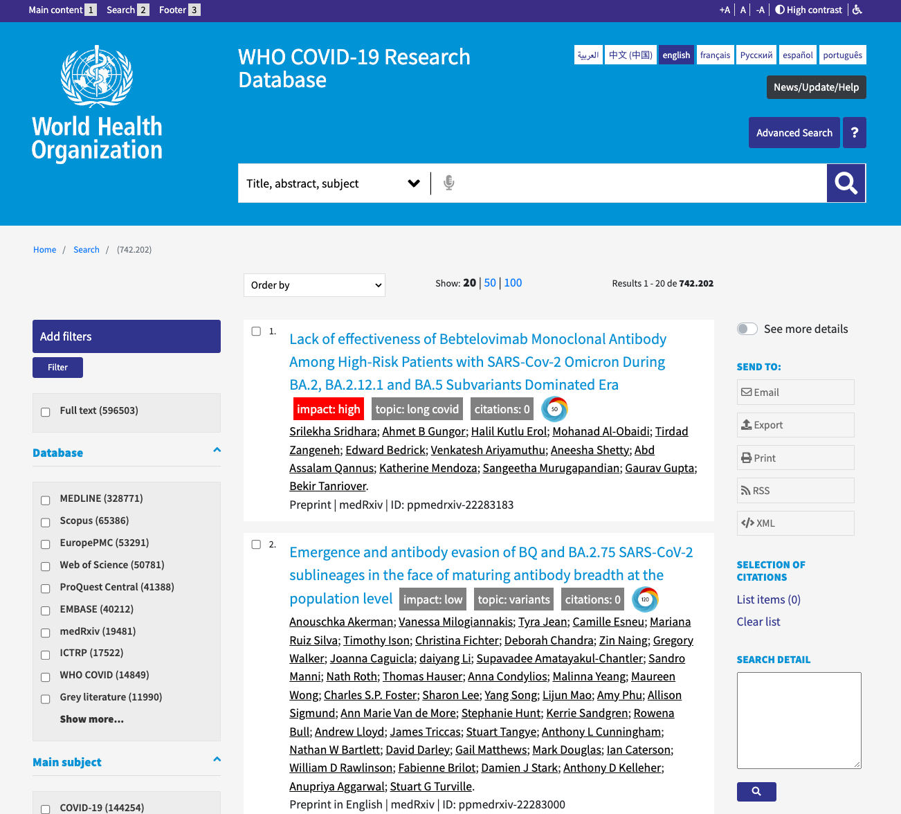
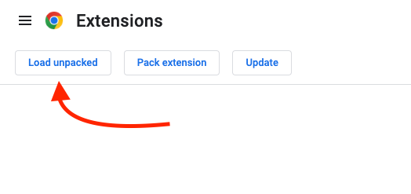
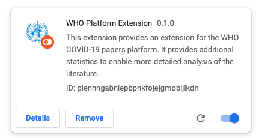
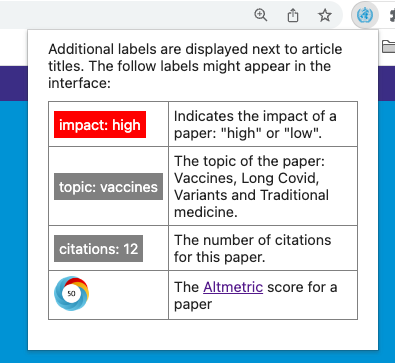

# WHO COVID-19 Research Database Extension

This Chrome extension enhances the [WHO COVID-19 Research Database](https://search.bvsalud.org/global-literature-on-novel-coronavirus-2019-ncov/) by providing additional labels to articles listed in the interface. See the labels next to the article titles in the screenshot below.

## Features

Additional labels are displayed including:

- Influential level: either high or low
- Citation count
- Altmetric
- Article topic

## Install

The extension is currently not yet available in the Chrome store. You can download the source of this project, and load it manually. Also make sure the paper classifier is running on `http://127.0.0.1:8000/`. (More information about the paper classifier will be added later.)

1. Clone this repository
2. Visit `chrome://extensions` in the browser
3. Click on the `Load unpacked` button

   

4. Find the `build` directory in the just cloned repository and select it. The extension should be visible now in the extension list:

   

5. Visit the [WHO COVID-19 Research Database](https://search.bvsalud.org/global-literature-on-novel-coronavirus-2019-ncov/) (the extension is only activated on this website). The extension will be visible as displayed below. Additionally, the article titles in the search interface will include additional labels.

   

## Development

Ensure you have [node](https://nodejs.org/en/) (>16) and npm installed.

1. Perform the steps above to install the extension
2. Within the root directory of this plugin, run `npm install`
3. Afterwards run `npm run watch` to run the development server
4. When you make a change to the code, by sure to click the 'reload' button next to the extension on the extension page: `chrome://extensions`

---

This project was bootstrapped with [Chrome Extension CLI](https://github.com/dutiyesh/chrome-extension-cli)
